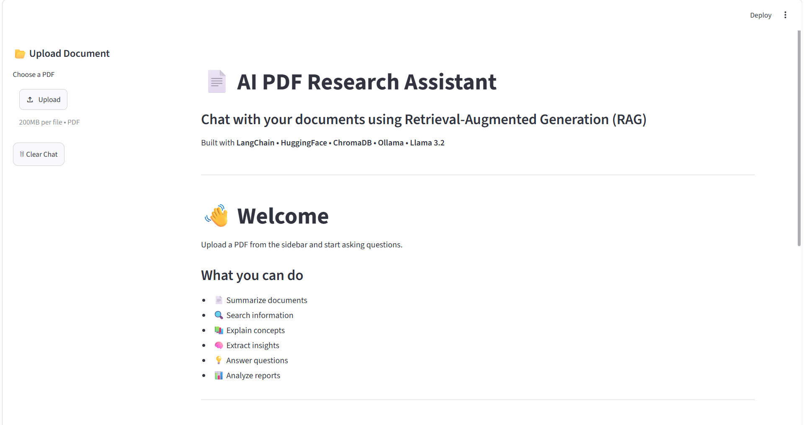
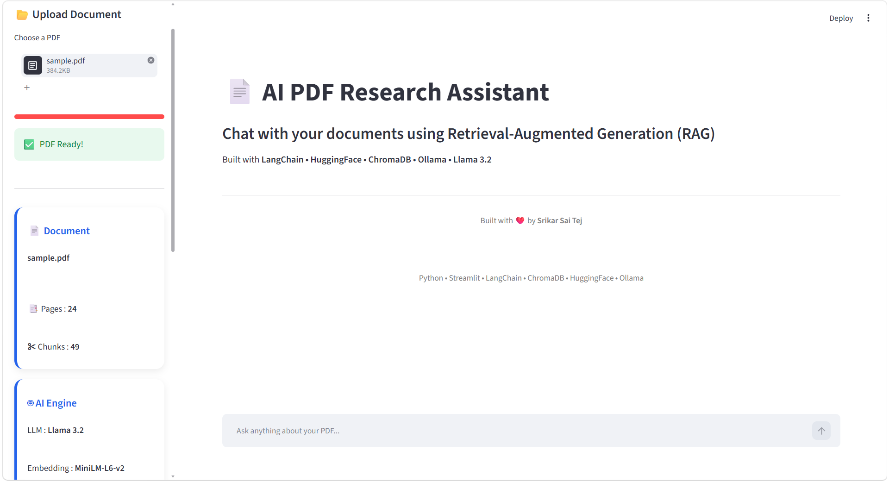
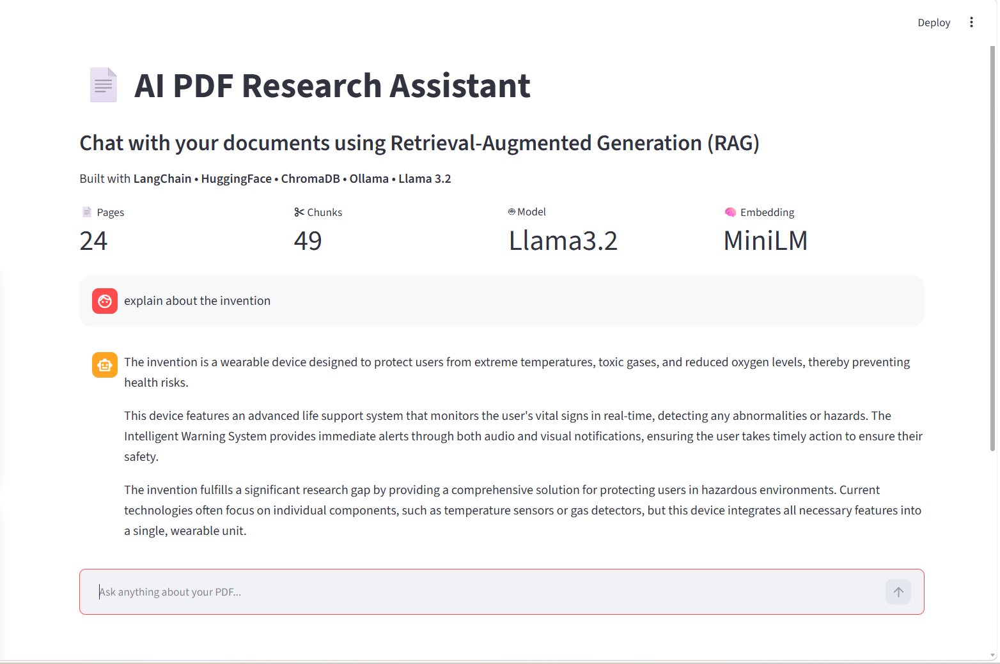

# 📄 RAG PDF Research Assistant

RAG PDF Research Assistant is an AI-powered document intelligence application that enables users to upload and interact with any text-based PDF document—including research papers, resumes, reports, manuals, project documentation, books, and technical documents—using natural language. The application combines Retrieval-Augmented Generation (RAG), LangChain, HuggingFace Embeddings, ChromaDB, and a locally hosted Llama 3.2 model to provide accurate, context-aware responses, document summarization, semantic search, and AI-generated document insights.

---

## 🚀 Features

- 📄 Upload and analyze any text-based PDF document
- 🤖 AI-powered document understanding using RAG
- 💬 Natural language question answering
- 📝 Intelligent document summarization
- 🔍 Semantic search with vector embeddings
- 📚 Context-aware responses grounded in document content
- 📑 Source page references for generated answers
- 💡 AI-generated document insights
- 📊 Document statistics (pages & chunks)
- 💬 Persistent chat history during the session
- ⚡ Local inference using Ollama and Llama 3.2
- 🎨 Modern and responsive Streamlit interface

---

# 🏗️ System Architecture

```
                    Upload PDF
                         │
                         ▼
                   PyPDFLoader
                         │
                         ▼
                  Text Cleaning
                         │
                         ▼
              Recursive Chunking
                         │
                         ▼
           HuggingFace Embeddings
                         │
                         ▼
                  Chroma Vector DB
                         │
                         ▼
              Top-K Similar Chunks
                         │
                         ▼
             LangChain RAG Pipeline
                         │
                         ▼
               Llama 3.2 (Ollama)
                         │
                         ▼
                 AI Generated Answer
```

---

# 📸 Application Screenshots

## 🏠 Home Page



---

## 📂 Upload PDF



---

## 💬 Chat Interface



---

# ⚙️ Technology Stack

| Technology | Purpose |
|------------|---------|
| Python | Programming Language |
| Streamlit | User Interface |
| LangChain | RAG Orchestration |
| Ollama | Local LLM Runtime |
| Llama 3.2 | Large Language Model |
| HuggingFace | Sentence Embeddings |
| ChromaDB | Vector Database |
| PyPDF | PDF Loading |
| RecursiveCharacterTextSplitter | Document Chunking |
| Sentence Transformers | Embedding Model |

---

# 📂 Project Structure

```
RAG-PDF-Research-Assistant/
│
├── app.py
├── config.py
├── requirements.txt
├── README.md
├── .gitignore
│
├── data/
│   └── sample.pdf
│
├── screenshots/
│   ├── home.png
│   ├── upload.png
│   └── chat.png
│
├── styles/
│   └── style.css
│
└── utils/
    ├── cleaner.py
    ├── document_insights.py
    ├── embeddings.py
    ├── pdf_loader.py
    ├── rag_pipeline.py
    ├── router.py
    ├── splitter.py
    ├── summarizer.py
    └── vector_store.py
```

---

# 🔄 Workflow

1. Upload a PDF document.
2. Extract text using PyPDFLoader.
3. Clean and preprocess the extracted text.
4. Split the document into overlapping chunks.
5. Generate semantic embeddings using HuggingFace.
6. Store embeddings in ChromaDB.
7. Retrieve the most relevant chunks.
8. Generate document-grounded responses using Llama 3.2.
9. Display answers with source page references.

---

# 🧠 RAG Pipeline

```
User Question
      │
      ▼
Semantic Search
      │
      ▼
Relevant Chunks
      │
      ▼
Prompt Construction
      │
      ▼
Llama 3.2
      │
      ▼
Generated Answer
```

---

# 🚀 Installation

## Clone Repository

```bash
git clone https://github.com/Srikarsaitej/RAG-PDF-Research-Assistant.git

cd RAG-PDF-Research-Assistant
```

---

## Create Virtual Environment

### Windows

```bash
python -m venv venv

venv\Scripts\activate
```

### Linux / macOS

```bash
python3 -m venv venv

source venv/bin/activate
```

---

## Install Dependencies

```bash
pip install -r requirements.txt
```

---

## Install Ollama

Download from:

https://ollama.com

Pull the model:

```bash
ollama pull llama3.2
```

Run Ollama:

```bash
ollama serve
```

---

## Run Application

```bash
streamlit run app.py
```

---

# 💡 Example Questions

- Summarize this document.
- Explain this document in simple terms.
- What is the main objective?
- List the key findings.
- What technologies are mentioned?
- Who are the authors?
- Give me the conclusion.
- Explain the methodology.
- What skills are listed? (Resume)
- What experience does the candidate have? (Resume)
- What recommendations are made? (Report)

---

# 📈 Future Improvements


- Multi-document support
- Document comparison
- AI-generated suggested questions
- Chat export (PDF/Markdown)
- Cloud deployment
- Docker support
- Authentication
- Conversation memory
- OCR support for scanned PDFs

---

# 🎯 Skills Demonstrated


- Retrieval-Augmented Generation (RAG)
- Large Language Models (LLMs)
- Semantic Search
- Vector Databases
- Prompt Engineering
- LangChain
- HuggingFace Embeddings
- ChromaDB
- Ollama
- Streamlit Development
- AI Application Development
- Python

---

# 👨‍💻 Author

**Srikar Sai Tej**

GitHub:
https://github.com/Srikarsaitej

LinkedIn:
https://www.linkedin.com/in/srikar-sai/

---

# ⭐ If you found this project useful, consider giving it a Star!